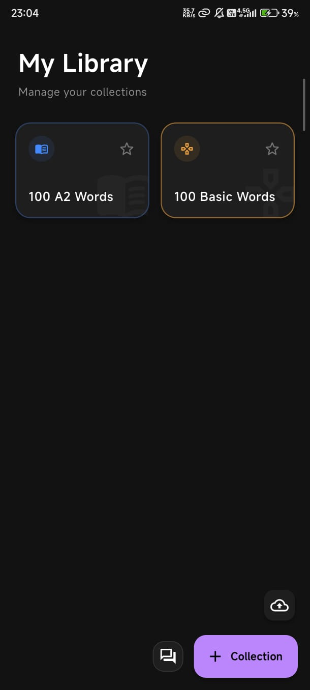
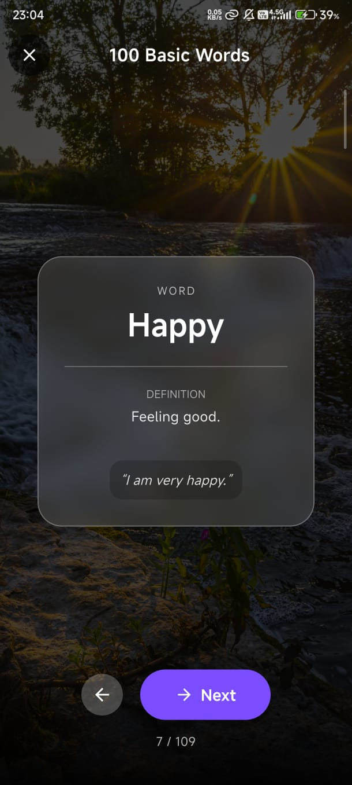
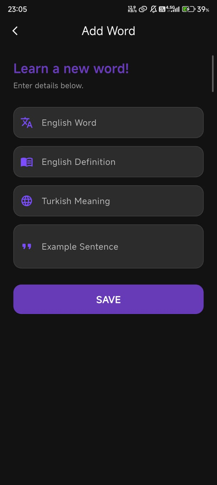

# 🇬🇧 English Flashcards

   

**English Flashcards** is a sleek, modern, dark-themed vocabulary learning application built with Flutter. It focuses on simplicity and efficiency, helping you master new words through active recall and gamified learning modes.

---

## ✨ Key Features

### 🗂️ **Smart Collections**
-   **Organize**: Create custom word sets (e.g., "B2 Business", "Travel Essentials").
-   **Import/Export**: Share your lists easily via JSON.
-   **Bulk Import**: Speed up your workflow by pasting JSON lists directly into the app.
-   **Smart Deduplication**: Automatically detects and skips duplicates during import to keep your collections clean.
-   **Quick Toggle**: Switch between **Game Mode** 🎮 and **Study Mode** 📖 instantly with a single tap on the home screen.
-   **Visual Cues**: Collections are color-coded (Orange for Game, Blue for Study) for instant recognition.

### 📖 **Study Mode**
*Focus on learning and retention.*
-   **Auto-Reveal**: Meaning is revealed automatically after 15 seconds to keep you moving.
-   **Tap-to-Reveal**: Can't wait? Tap the card to see the answer instantly.
-   **Clean UI**: Distraction-free interface with glassmorphism effects.

### 🎮 **Game Mode**
*Fun for groups and active practice.*
-   **Group Play**: Hold the phone to your forehead! Your friends describe the word on the screen, and you guess it.
-   **No Timers**: Take your time to explain and guess.
-   **Hidden Meaning**: Only the word is shown to the "explainer".

### ⚡ **Modern Experience**
-   **Dark Mode**: Easy on the eyes, perfect for night study sessions.
-   **Fluid Animations**: Smooth transitions between cards and screens.
-   **Offline First**: All data is stored locally using SQLite.

---

## 📸 Screenshots

| **Home Library** | **Study Card** | **Add New Word** |
|:---:|:---:|:---:|
|  |  |  |

*(Note: Screenshots are stored in `assets/screenshots/`)*

---

## 🚀 Getting Started

Follow these steps to get a local copy up and running.

### Prerequisites
-   [Flutter SDK](https://flutter.dev/docs/get-started/install) installed.
-   An IDE like VS Code or Android Studio.

### Installation

1.  **Clone the valid repo**
    ```bash
    git clone https://github.com/kemaltombul/flashcards.git
    cd flashcards
    ```

2.  **Install Dependencies**
    ```bash
    flutter pub get
    ```

3.  **Run the App**
    ```bash
    flutter run
    ```

---

## 📂 Project Structure

A quick look at the top-level directory structure:

```
lib/
├── models/         # Data classes (Word, Collection)
├── screens/        # UI Pages (Home, Card, Settings)
├── services/       # Core Logic (DatabaseService)
└── main.dart       # Entry point
assets/
└── initial_data.json # Default vocabulary sets
```

---

## 🛠️ Built With

-   **[Flutter](https://flutter.dev)** - Google's UI toolkit for building beautiful, natively compiled applications.
-   **[sqflite](https://pub.dev/packages/sqflite)** - SQLite plugin for Flutter.
-   **[path_provider](https://pub.dev/packages/path_provider)** - File system access.
-   **[share_plus](https://pub.dev/packages/share_plus)** - Content sharing.

---

## 🤝 Contributing

Contributions make the open-source community such an amazing place to learn, inspire, and create. Any contributions you make are **greatly appreciated**.

1.  Fork the Project
2.  Create your Feature Branch (`git checkout -b feature/AmazingFeature`)
3.  Commit your Changes (`git commit -m 'Add some AmazingFeature'`)
4.  Push to the Branch (`git push origin feature/AmazingFeature`)
5.  Open a Pull Request

---

## 📄 License

Distributed under the MIT License. See `LICENSE` for more information.

---

<p align="center">Made with ❤️ by <a href="https://github.com/kemaltombul">Kemal Tombul</a></p>
